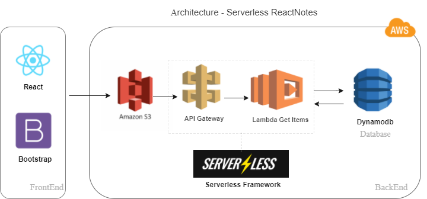
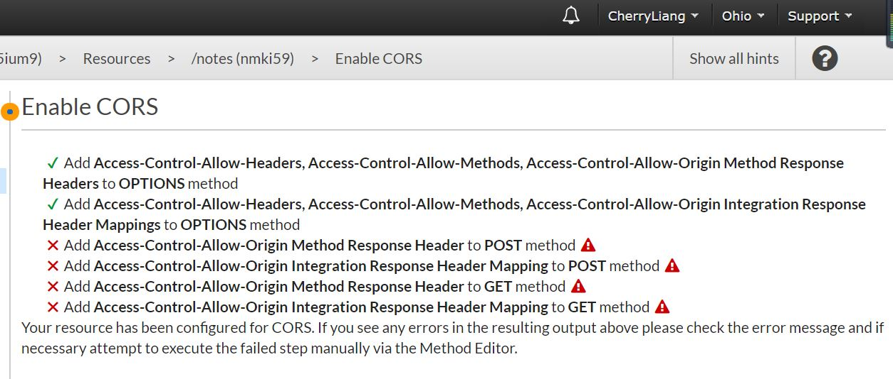
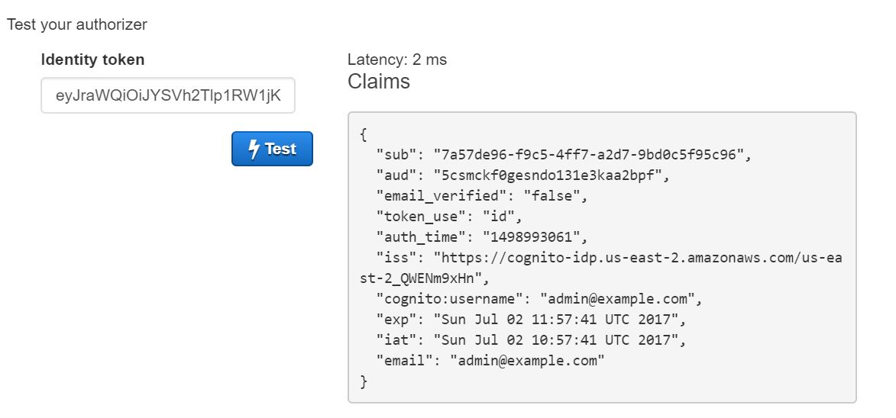
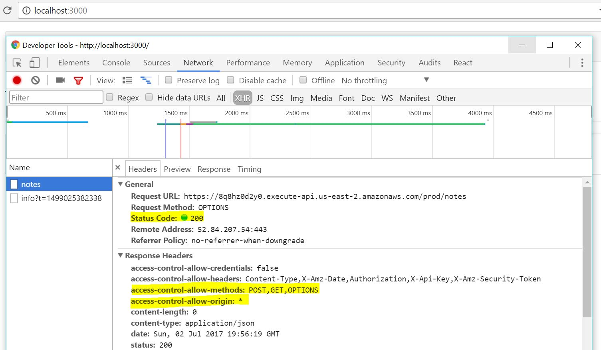

# Serverless ReactNotes
This is a SPA built with React and AWS Serverless service.

---
#### Story
> A problem is a chance for you to improve yourself and do your best.

I have built SPAs with vueJS([demo](https://github.com/CaiYiLiang/vue-demos)) and React([demo](https://github.com/CaiYiLiang/ReactNews)), but it is my first time to get deep into Serverless :thinking: . So what's this, is it something like the heroku or websphere I use before? Then I do some study on Serverless (I asked google/gitter chatroom/[youtube](https://www.youtube.com/watch?v=fSUEk6iMW88&index=1&list=PLzvRQMJ9HDiSQMe68cti8cupI0mzLk1Gc)) and I found no, it is not like backend technicals I applied beore. I feel lucky that I got this chance to study serverless Architectures.

Serverless Stack comes with below advantages:
- Low maintenance : You don't need to worried about server maintance(Such as the issues I met in my previous company: hight cpu, disk storage and perfoemance), as you push the code to third-party platforms and run there.
- Low cost : You will be charged when there is request.
- Easy to scale
Overall, all you need to worry about is the code.You can foucs on your code,your product and user experience.

I spent some time on Serverless Architectures and I built a Serverless-ReactNotesApp with React([Create React App](https://github.com/facebookincubator/create-react-app)) + [React-bootstrap](https://react-bootstrap.github.io/) + [React-Router](https://reacttraining.com/react-router/) + AWS [S3](https://aws.amazon.com/s3/) + [Serverless Framework](https://serverless.com/framework/)(API Gateway + Lambda) + [Dynamodb](http://docs.aws.amazon.com/amazondynamodb/latest/developerguide/Introduction.html)

I got stuck on seeting issues with API Gateway, the features like Login/Signup/CURD work well,sometimes there will network issue. So the UI may be not perfect.But I will keep on improving this demo:grin:
Here is the **[demo](http://cherry-client-bucket.s3-website-us-east-1.amazonaws.com/)**

##### Structure
  
   

  - [FrontEnd-ReactNotes]()
    - SPA - Build with React([Create React App](https://github.com/facebookincubator/create-react-app)) + [React-bootstrap](https://react-bootstrap.github.io/) + [React-Router](https://reacttraining.com/react-router/). 
    - [Amazon Cognito](https://aws.amazon.com/documentation/cognito/)
      - User Singup & Login
      - Identification
    - Call [API Gateway](https://aws.amazon.com/api-gateway/)
      - Creat Notes
      - Read Notes
      - Update Notes
      - Delete Notes

   - [BackEnd-serverless-api]()
      - [Serverless Framework]() - Amazon API Gateway + AWS Lambda
      - Deploy API Gateway
        - Creat Notes
        - Read Notes
        - Update Notes
        - Delete Notes
      - [Mock test]()

##### Where I got stuck
    - API Gateway CROS

    
   
    
   
    

       

